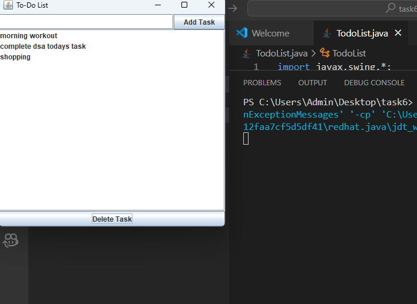

# ✅ To-Do List (Java Swing)

A simple **Java Swing GUI application** that allows users to manage tasks in a **To-Do List**.  
You can **add tasks** using a text field and **delete selected tasks** using buttons.

---

## 🚀 Features
- Add tasks using a `JTextField` and `Add Task` button
- Display tasks in a `JList`
- Delete tasks using the `Delete Task` buttons
- Scrollable task list with `JScrollPane`
- User-friendly GUI with `JFrame`

---

## output

